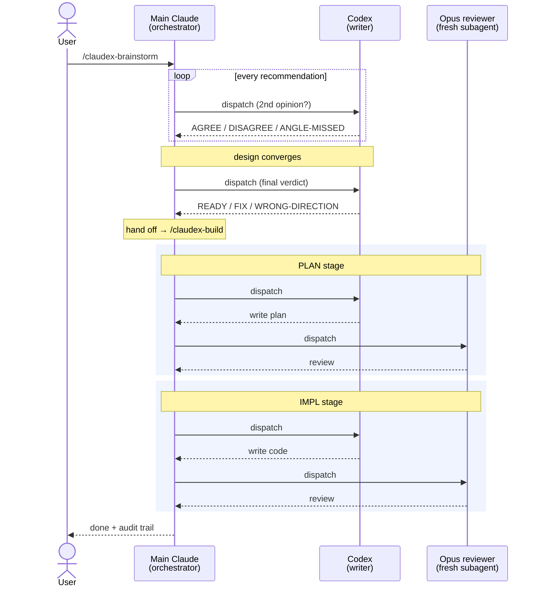

# ClaudeX

**Multi-model collaboration on top of [superpowers](https://github.com/obra/superpowers).** Codex gives a second opinion at every recommendation in brainstorming, then writes plan and implementation while Opus reviews — so drift gets caught even when no human reads the spec.

---

## Why ClaudeX

`superpowers` is a great skill library, but its design assumes the **user reads the spec and the plan**. In practice almost no one does. That single-model loop has three drift points:

1. Brainstorming offers one recommendation per question — whatever the model leans toward.
2. The spec is written by the same model that ran the brainstorm.
3. The plan is written by the same model again, against a spec the user skimmed at best.

The intended drift defense is human review. The actual drift defense is hope.

**ClaudeX replaces the missing human gate with a model gate.** Two models, different vendors, different inductive biases — Claude (Opus) and OpenAI Codex. They disagree on real things. Their disagreements catch real bugs.

## How ClaudeX runs (vs upstream's single-model loop)

In `superpowers`, one model runs the whole pipeline (brainstorm → spec → plan → impl) and the user is expected to gate at the spec. ClaudeX makes the loop multi-actor: every recommendation gets a Codex second opinion, and every artifact (plan, impl) gets an independent Opus review.



**The reviewer judges every artifact against three principles:**

- **Minimal** — could the artifact be materially smaller without losing information? Flag only when simplification removes ≥10% of size or eliminates a structural element (a step, a file, a helper). Not word-by-word tightening.
- **Consistent** — does it follow the project's existing patterns (naming, error style, test structure, file organization)?
- **Verifiable** — do the tests actually exercise the changed behavior? Would they fail if the implementation were wrong? Or are the assertions tautologies that pass against the artifact itself?

## Side-by-side with plain `superpowers`

| | superpowers | ClaudeX |
|---|---|---|
| Brainstorming recommendations | one model's lean | side-by-side Claude + Codex |
| Final-design check before spec | none | Codex verdict (`READY` / `FIX` / `WRONG-DIRECTION`) |
| Plan writer | Claude | Codex (latest model) |
| Plan reviewer | none / user | fresh Opus 4.7 subagent (DRIFT + QUALITY + VERDICT) |
| Impl writer | user / claude | Codex |
| Impl reviewer | none / user | fresh Opus 4.7 subagent |
| Drift defense if user skims | hope | model |
| Cost | 1 model | 2 models, ~2× tokens at brainstorm peaks |

## Quick start

```bash
# 1. Clone alongside any existing superpowers install (no collision)
git clone https://github.com/WillInvest/ClaudeX.git ~/.claude/plugins/claudex

# 2. Symlink the skills + commands into the user-local Claude Code path
ln -s ~/.claude/plugins/claudex/skills/brainstorming      ~/.claude/skills/claudex-brainstorming
ln -s ~/.claude/plugins/claudex/skills/claudex-build      ~/.claude/skills/claudex-build
ln -s ~/.claude/plugins/claudex/commands/brainstorm.md    ~/.claude/commands/claudex-brainstorm.md
ln -s ~/.claude/plugins/claudex/commands/claudex-build.md ~/.claude/commands/claudex-build.md

# 3. Verify codex CLI is available
codex --version  # need >= 0.122.0
```

Then in Claude Code:

```
/claudex-brainstorm  let's add a --verbose flag to my CLI tool
```

ClaudeX takes it from there: Claude + Codex co-brainstorm → spec → autonomous plan → autonomous impl → final summary, with terse 3-line status updates per stage and a full audit trail you can read after.

## Credits & license

ClaudeX is a fork of [obra/superpowers](https://github.com/obra/superpowers) by Jesse Vincent — the structural skills (brainstorming, writing-plans, executing-plans, TDD, debugging, ...) are upstream's work; ClaudeX layers a multi-model collaboration pattern on top. Big thanks to the upstream project; without it there's nothing to fork.

Released under the [MIT License](./LICENSE), preserving upstream's copyright notice.

## Feedback

Open an issue, send a PR, or just star the repo if the dual-model framing resonates. `v0.1.0` is verified end-to-end on smoke tests; battle-testing on real projects is the next step.
