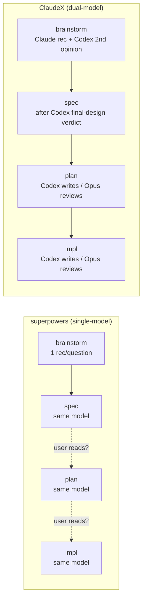

# ClaudeX

**Multi-model collaboration on top of [superpowers](https://github.com/obra/superpowers).** Codex gives a second opinion at every recommendation in brainstorming, then writes plan and implementation while Opus reviews — so drift gets caught even when no human reads the spec.

> Status: `v0.1.0-verified` — three end-to-end smoke tests passing. Looking for feedback and stars.

---

## Why ClaudeX

`superpowers` is a great skill library, but its design assumes the **user reads the spec and the plan**. In practice almost no one does. That single-model loop has three drift points:

1. Brainstorming offers one recommendation per question — whatever the model leans toward.
2. The spec is written by the same model that ran the brainstorm.
3. The plan is written by the same model again, against a spec the user skimmed at best.

The intended drift defense is human review. The actual drift defense is hope.

**ClaudeX replaces the missing human gate with a model gate.** Two models, different vendors, different inductive biases — Claude (Opus) and OpenAI Codex. They disagree on real things. Their disagreements catch real bugs.

In our smoke test the Opus reviewer caught a `FMT_BRIEF`/`FMT_DETAIL` drift that Codex's own pytest passed against the wrong constants — exactly the silent-passing bug the user would never have noticed.

## How it differs from superpowers



Concretely, ClaudeX adds:

- **`/claudex-brainstorm`** — same as upstream brainstorming, plus:
  - At every multi-choice question or "I recommend X" moment, Claude dispatches Codex via `codex exec` and shows a side-by-side counter-recommendation (≤60 words: `AGREE` / `DISAGREE` / `ANGLE-MISSED`).
  - Before the spec is written, Codex gets one shot at the full transcript + design and returns a `READY | FIX | WRONG-DIRECTION` verdict (≤200 words).
  - The "user reviews spec" gate is removed — brainstorm hands off directly to `claudex-build`.
- **`/claudex-build`** — new autonomous plan→impl pipeline. Codex (latest model) writes the plan and the implementation; a fresh Opus 4.7 subagent reviews each artifact for `DRIFT` (vs source) + `QUALITY` (`[Minimal]` / `[Consistent]` / `[Verifiable]`) + `VERDICT` (`ready-to-execute` / `fix-and-proceed` / `re-review-needed` / `escalate`). Hard cap of 2 review rounds per stage. Full audit trail at `/tmp/claudex/<run-id>/`.

Everything else is upstream `superpowers/5.0.7` verbatim. Modified files are bracketed with `<!-- CLAUDEX:BEGIN -->` / `<!-- CLAUDEX:END -->` markers so upstream merges stay mechanical.

## Quick start

```bash
# 1. Clone alongside any existing superpowers install (no collision)
git clone https://github.com/WillInvest/ClaudeX.git ~/.claude/plugins/claudex

# 2. Symlink the skills + commands into the user-local Claude Code path
ln -s ~/.claude/plugins/claudex/skills/brainstorming      ~/.claude/skills/claudex-brainstorming
ln -s ~/.claude/plugins/claudex/skills/claudex-build      ~/.claude/skills/claudex-build
ln -s ~/.claude/plugins/claudex/commands/brainstorm.md    ~/.claude/commands/claudex-brainstorm.md
ln -s ~/.claude/plugins/claudex/commands/claudex-build.md ~/.claude/commands/claudex-build.md

# 3. Verify codex CLI is available
codex --version  # need >= 0.122.0
```

Then in Claude Code:

```
/claudex-brainstorm  let's add a --verbose flag to my CLI tool
```

ClaudeX takes it from there: Claude + Codex co-brainstorm → spec → autonomous plan → autonomous impl → final summary, with terse 3-line status updates per stage and a full audit trail you can read after.

## Requirements

- **Claude Code** with `Agent` tool and `model: "opus"` resolution (today: Opus 4.7).
- **Codex CLI** ≥ 0.122.0 (`codex exec resume --last` is required for round-2 session continuity).
- Both `claude` and `codex` available on your `$PATH`.

## What you get vs. running plain `superpowers`

| | superpowers | ClaudeX |
|---|---|---|
| Brainstorming recommendations | one model's lean | side-by-side Claude + Codex |
| Final-design check before spec | none | Codex verdict (`READY` / `FIX` / `WRONG-DIRECTION`) |
| Plan writer | Claude | Codex (latest model) |
| Plan reviewer | none / user | fresh Opus 4.7 subagent (DRIFT + QUALITY + VERDICT) |
| Impl writer | user / claude | Codex |
| Impl reviewer | none / user | fresh Opus 4.7 subagent |
| Drift defense if user skims | hope | model |
| Cost | 1 model | 2 models, ~2× tokens at brainstorm peaks |

If your spec/plan/impl review habit is reliable, plain `superpowers` is fine — ClaudeX is the right call when the loop has to be honest about how little the user actually reads.

## Project layout

```
~/.claude/plugins/claudex/
├── skills/
│   ├── brainstorming/SKILL.md   # 3 CLAUDEX:BEGIN/END insertions over upstream
│   └── claudex-build/SKILL.md   # new — autonomous plan→impl pipeline
├── commands/
│   ├── brainstorm.md            # deprecation-stub redirect
│   └── claudex-build.md         # /claudex-build
├── UPSTREAM.md                  # fork base + merge log
├── LICENSE                      # MIT (preserves upstream copyright)
└── ...                          # rest is upstream superpowers/5.0.7 verbatim
```

See [UPSTREAM.md](./UPSTREAM.md) for the merge procedure when upstream releases a new version.

## Credits & license

ClaudeX is a fork of [obra/superpowers](https://github.com/obra/superpowers) by Jesse Vincent — the structural skills (brainstorming, writing-plans, executing-plans, TDD, debugging, ...) are upstream's work; ClaudeX layers a multi-model collaboration pattern on top. Big thanks to the upstream project; without it there's nothing to fork.

Released under the [MIT License](./LICENSE), preserving upstream's copyright notice.

## Feedback

Open an issue, send a PR, or just star the repo if the dual-model framing resonates. The smoke-test path is real but `v0.1.0` — battle-testing on real projects is the next step.
