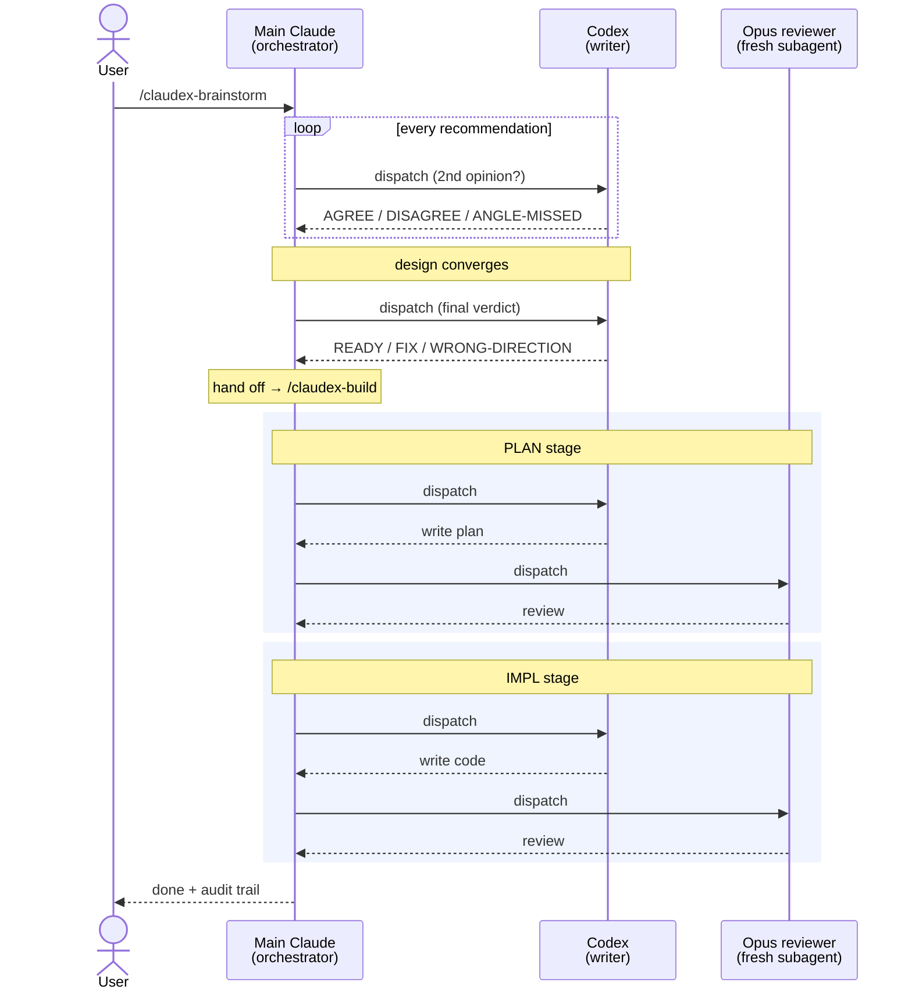
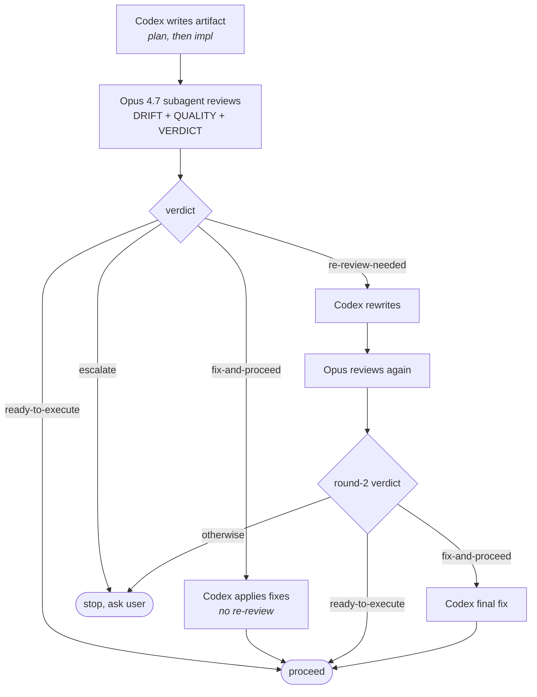

# ClaudeX

**Multi-model collaboration on top of [superpowers](https://github.com/obra/superpowers).** Codex gives a second opinion at every recommendation in brainstorming, then writes plan and implementation while Opus reviews — so drift gets caught even when no human reads the spec.

> Status: `v0.1.0-verified` — three end-to-end smoke tests passing. Looking for feedback and stars.

---

## Why ClaudeX

`superpowers` is a great skill library, but its design assumes the **user reads the spec and the plan**. In practice almost no one does. That single-model loop has three drift points:

1. Brainstorming offers one recommendation per question — whatever the model leans toward.
2. The spec is written by the same model that ran the brainstorm.
3. The plan is written by the same model again, against a spec the user skimmed at best.

The intended drift defense is human review. The actual drift defense is hope.

**ClaudeX replaces the missing human gate with a model gate.** Two models, different vendors, different inductive biases — Claude (Opus) and OpenAI Codex. They disagree on real things. Their disagreements catch real bugs.

## How ClaudeX runs (vs upstream's single-model loop)

In `superpowers`, one model runs the whole pipeline (brainstorm → spec → plan → impl) and the user is expected to gate at the spec. ClaudeX makes the loop multi-actor: every recommendation gets a Codex second opinion, and every artifact (plan, impl) gets an independent Opus review.



**Main Claude is the orchestrator only** — it dispatches Codex (writer) and the Opus reviewer subagent, parses verdicts, decides convergence. It never writes the plan or impl itself.

Modifications stay surgical: three insertions in one upstream `SKILL.md` plus one new skill. Modified files are bracketed with `<!-- CLAUDEX:BEGIN -->` / `<!-- CLAUDEX:END -->` markers so upstream merges stay mechanical. Everything else is upstream `superpowers/5.0.7` verbatim.

## What it does, by stage

### `/claudex-brainstorm` — second-opinion at every decision

Three Codex insertions on top of upstream's brainstorming flow:

| When it fires | What happens | Output | Cap |
|---|---|---|---|
| Claude is about to ask a multi-choice / "I recommend X" question | dispatch `codex exec` with the transcript + Claude's draft rec | side-by-side: `AGREE` / `DISAGREE` / `ANGLE-MISSED` | ≤60 words |
| Design has converged, before spec is written | dispatch `codex exec` with full transcript + agreed design | `READY` / `FIX` / `WRONG-DIRECTION` (one shot, no re-dispatch) | ≤200 words |
| Spec is written | upstream's "user reviews spec" gate is **removed**; hand off directly | invoke `/claudex-build` | — |

If `codex` is unavailable, the brainstorm gracefully falls back to upstream behavior — Codex insertions are additive, never blocking.

### `/claudex-build` — autonomous plan → impl with two-model review

Each stage runs the same loop. The orchestrator (main Claude) only dispatches and decides; it never writes the artifact itself.



**Reviewer output is structured.** Three sections in this exact order:

| Section | Purpose | Tags / shape |
|---|---|---|
| `## DRIFT` | Where artifact diverges from source (spec → plan, plan → impl) | numbered list; `none` if clean |
| `## QUALITY` | Issues against three criteria | `[Minimal]` / `[Consistent]` / `[Verifiable]` |
| `## VERDICT` | One-liner that the orchestrator parses literally | one of four strings (below) |

**The four verdicts:**

| Verdict | What it means | Loop action |
|---|---|---|
| `ready-to-execute` | DRIFT empty AND no blocking QUALITY findings | proceed, no fix |
| `fix-and-proceed` | minor actionable issues; reviewer signs off in advance | Codex applies fixes, no re-review |
| `re-review-needed` | substantive issues needing judgment | Codex rewrites + round-2 review (round 1 only) |
| `escalate` | wrong direction, missing context, destructive risk | stop, surface to user |

Hard cap: **2 review rounds per stage.** Round 2 is final — `re-review-needed` at round 2 escalates instead of looping. Audit trail at `/tmp/claudex/<run-id>/` (numbered files: `00-spec.md`, `10-plan-prompt.md`, `11-plan-r1.md`, ..., `99-final-summary.md`).

## Side-by-side with plain `superpowers`

| | superpowers | ClaudeX |
|---|---|---|
| Brainstorming recommendations | one model's lean | side-by-side Claude + Codex |
| Final-design check before spec | none | Codex verdict (`READY` / `FIX` / `WRONG-DIRECTION`) |
| Plan writer | Claude | Codex (latest model) |
| Plan reviewer | none / user | fresh Opus 4.7 subagent (DRIFT + QUALITY + VERDICT) |
| Impl writer | user / claude | Codex |
| Impl reviewer | none / user | fresh Opus 4.7 subagent |
| Drift defense if user skims | hope | model |
| Cost | 1 model | 2 models, ~2× tokens at brainstorm peaks |

If your spec/plan/impl review habit is reliable, plain `superpowers` is fine — ClaudeX is the right call when the loop has to be honest about how little the user actually reads.

## Quick start

```bash
# 1. Clone alongside any existing superpowers install (no collision)
git clone https://github.com/WillInvest/ClaudeX.git ~/.claude/plugins/claudex

# 2. Symlink the skills + commands into the user-local Claude Code path
ln -s ~/.claude/plugins/claudex/skills/brainstorming      ~/.claude/skills/claudex-brainstorming
ln -s ~/.claude/plugins/claudex/skills/claudex-build      ~/.claude/skills/claudex-build
ln -s ~/.claude/plugins/claudex/commands/brainstorm.md    ~/.claude/commands/claudex-brainstorm.md
ln -s ~/.claude/plugins/claudex/commands/claudex-build.md ~/.claude/commands/claudex-build.md

# 3. Verify codex CLI is available
codex --version  # need >= 0.122.0
```

Then in Claude Code:

```
/claudex-brainstorm  let's add a --verbose flag to my CLI tool
```

ClaudeX takes it from there: Claude + Codex co-brainstorm → spec → autonomous plan → autonomous impl → final summary, with terse 3-line status updates per stage and a full audit trail you can read after.

## Requirements

- **Claude Code** with `Agent` tool and `model: "opus"` resolution (today: Opus 4.7).
- **Codex CLI** ≥ 0.122.0 (`codex exec resume --last` is required for round-2 session continuity).
- Both `claude` and `codex` available on your `$PATH`.

## Project layout

```
~/.claude/plugins/claudex/
├── skills/
│   ├── brainstorming/SKILL.md   # 3 CLAUDEX:BEGIN/END insertions over upstream
│   └── claudex-build/SKILL.md   # new — autonomous plan→impl pipeline
├── commands/
│   ├── brainstorm.md            # deprecation-stub redirect
│   └── claudex-build.md         # /claudex-build
├── UPSTREAM.md                  # fork base + merge log
├── LICENSE                      # MIT (preserves upstream copyright)
└── ...                          # rest is upstream superpowers/5.0.7 verbatim
```

See [UPSTREAM.md](./UPSTREAM.md) for the merge procedure when upstream releases a new version.

## Credits & license

ClaudeX is a fork of [obra/superpowers](https://github.com/obra/superpowers) by Jesse Vincent — the structural skills (brainstorming, writing-plans, executing-plans, TDD, debugging, ...) are upstream's work; ClaudeX layers a multi-model collaboration pattern on top. Big thanks to the upstream project; without it there's nothing to fork.

Released under the [MIT License](./LICENSE), preserving upstream's copyright notice.

## Feedback

Open an issue, send a PR, or just star the repo if the dual-model framing resonates. `v0.1.0` is verified end-to-end on smoke tests; battle-testing on real projects is the next step.
