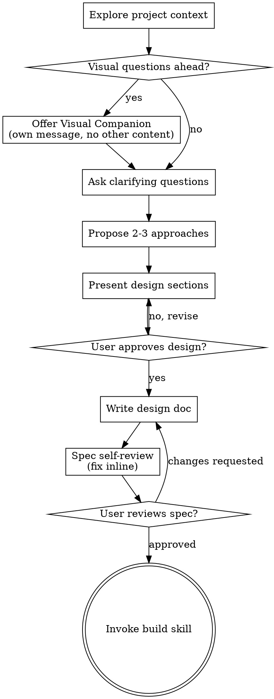

# Brainstorming Ideas Into Designs

Help turn ideas into fully formed designs and specs through natural collaborative dialogue.

<!-- CLAUDEX:BEGIN — codex availability probe at skill entry -->

**ONCE per skill invocation, before the first Codex dispatch**, probe codex availability via Bash:

```bash
command -v codex >/dev/null && echo CODEX_READY || echo CODEX_MISSING
```

- If `CODEX_READY`: use the `codex exec ...` dispatches in the blocks below as written.
- If `CODEX_MISSING`: notify the user ONCE with this exact line (no preamble, no other text):

> Codex CLI not detected — a Claude subagent will play Codex's role for this brainstorm. Dual-vendor diversity is degraded; independent-context review is preserved. Install codex (`npm install -g @openai/codex`) for the full dual-model behavior.

Then in EVERY codex dispatch block below, dispatch the equivalent prompt via the `Agent` tool with `subagent_type: "general-purpose"`, `model: "sonnet"`, and the full prompt body (everything between `<<'EOF'` and `EOF`) passed as `prompt`. The subagent's reply is treated as Codex's reply for that step. The output format requirements (one of A/B/C, READY/FIX/WRONG-DIRECTION, ≤word counts) still apply.

<!-- CLAUDEX:END -->

Start by understanding the current project context, then ask questions one at a time to refine the idea. Once you understand what you're building, present the design and get user approval.

<HARD-GATE>
Do NOT invoke any implementation skill, write any code, scaffold any project, or take any implementation action until you have presented a design and the user has approved it. This applies to EVERY project regardless of perceived simplicity.
</HARD-GATE>

## Anti-Pattern: "This Is Too Simple To Need A Design"

Every project goes through this process. A todo list, a single-function utility, a config change — all of them. "Simple" projects are where unexamined assumptions cause the most wasted work. The design can be short (a few sentences for truly simple projects), but you MUST present it and get approval.

## Checklist

You MUST create a task for each of these items and complete them in order:

1. **Explore project context** — check files, docs, recent commits
2. **Offer visual companion** (if topic will involve visual questions) — this is its own message, not combined with a clarifying question. See the Visual Companion section below.
3. **Ask clarifying questions** — one at a time, understand purpose/constraints/success criteria
4. **Propose 2-3 approaches** — with trade-offs and your recommendation
5. **Present design** — in sections scaled to their complexity, get user approval after each section
6. **Write design doc** — save to `docs/claudex/specs/YYYY-MM-DD-<topic>-design.md` and commit
7. **Spec self-review** — quick inline check for placeholders, contradictions, ambiguity, scope (see below)
8. **User reviews written spec** — ask user to review the spec file before proceeding
9. **Transition to implementation** — invoke build skill to run the autonomous plan→impl pipeline

## Process Flow



**The terminal state is invoking build.** Do NOT invoke writing-plans, frontend-design, mcp-builder, or any other implementation skill. The ONLY skill you invoke after brainstorming is build.

## The Process

**Understanding the idea:**

- Check out the current project state first (files, docs, recent commits)
- Before asking detailed questions, assess scope: if the request describes multiple independent subsystems (e.g., "build a platform with chat, file storage, billing, and analytics"), flag this immediately. Don't spend questions refining details of a project that needs to be decomposed first.
- If the project is too large for a single spec, help the user decompose into sub-projects: what are the independent pieces, how do they relate, what order should they be built? Then brainstorm the first sub-project through the normal design flow. Each sub-project gets its own spec → plan → implementation cycle.
- For appropriately-scoped projects, ask questions one at a time to refine the idea
- Prefer multiple choice questions when possible, but open-ended is fine too
- Only one question per message - if a topic needs more exploration, break it into multiple questions
- Focus on understanding: purpose, constraints, success criteria

<!-- CLAUDEX:BEGIN — dual-model dispatch at recommendation moments -->

**Codex second opinion at every recommendation moment:**

Whenever you are about to ask the user a question that (a) offers multiple choices (A/B/C, "pick X or Y") OR (b) carries a recommendation ("I recommend X", "My lean: A", "I'd go with B"), you MUST dispatch Codex first via Bash and present both opinions side by side.

Dispatch via:

```bash
codex exec \
  --sandbox read-only \
  --skip-git-repo-check \
  - <<'EOF'
You are reviewing a brainstorm in progress. Another model (Claude) is
about to ask the user a question.

# Brainstorm transcript so far
<paste transcript here>

# The question Claude drafted
<paste question here>

# Claude's recommendation
<paste recommendation + brief reasoning here>

Independently consider this question. Output exactly one of:
A) AGREE: <one line — same recommendation, may add a confirming reason>
B) DISAGREE: <one line — your recommendation + why it's better>
C) ANGLE-MISSED: <one line — a question Claude isn't asking but should>

≤ 60 words total. No preamble.
EOF
```

Then present to the user in this exact shape:

```
[Claude's question + recommendation]

[Codex second opinion]: <Codex's one-liner>

Your call.
```

If `CODEX_MISSING` from the entry probe, dispatch the same prompt via `Agent` tool (`subagent_type: "general-purpose"`, `model: "sonnet"`) instead of `codex exec`; the subagent's reply substitutes for Codex's. If the codex call itself fails at runtime (auth/network), do the same Agent fallback inline and note the failure to the user in one short line. Do not block the brainstorm.

<!-- CLAUDEX:END -->

**Exploring approaches:**

- Propose 2-3 different approaches with trade-offs
- Present options conversationally with your recommendation and reasoning
- Lead with your recommended option and explain why

**Presenting the design:**

- Once you believe you understand what you're building, present the design
- Scale each section to its complexity: a few sentences if straightforward, up to 200-300 words if nuanced
- Ask after each section whether it looks right so far
- Cover: architecture, components, data flow, error handling, testing
- Be ready to go back and clarify if something doesn't make sense

<!-- CLAUDEX:BEGIN — final-design Codex verdict -->

**Codex final-design verdict (one round only):**

Once the user has approved the converged design and BEFORE you write the spec doc, dispatch Codex once with the full transcript + the agreed design. Use this prompt:

```bash
codex exec \
  --sandbox read-only \
  --skip-git-repo-check \
  - <<'EOF'
You are reviewing the final design from a brainstorm. Another model
(Claude) and the user converged on the design below.

# Brainstorm transcript
<paste full transcript here>

# The agreed design
<paste design summary as presented to user>

Independent review. Output exactly one of:
- READY: <one line — design is sound, proceed to spec>
- FIX: <bulleted list, ≤5 items — concrete issues to address>
- WRONG-DIRECTION: <one line — fundamental rethink needed>

≤ 200 words total. No preamble.
EOF
```

Present the verdict to the user verbatim:

```
[Codex final-design verdict]:
<Codex's response>
```

Then, based on the verdict:
- **READY**: announce "Codex agrees, proceeding to spec." Move to "Write design doc."
- **FIX**: ask the user "Which of these should we incorporate?" Apply the user-chosen items to the design. **Do NOT re-dispatch Codex** — one round only. Then move to "Write design doc."
- **WRONG-DIRECTION**: ask the user whether to re-brainstorm from scratch or override Codex and proceed. Honor the user's choice.

If `CODEX_MISSING` from the entry probe, dispatch the same prompt via `Agent` tool (`subagent_type: "general-purpose"`, `model: "sonnet"`) instead of `codex exec`; the subagent's reply substitutes for Codex's verdict (still one round only). If the codex call fails at runtime, do the same Agent fallback inline and note the failure to the user in one short line.

<!-- CLAUDEX:END -->

**Design for isolation and clarity:**

- Break the system into smaller units that each have one clear purpose, communicate through well-defined interfaces, and can be understood and tested independently
- For each unit, you should be able to answer: what does it do, how do you use it, and what does it depend on?
- Can someone understand what a unit does without reading its internals? Can you change the internals without breaking consumers? If not, the boundaries need work.
- Smaller, well-bounded units are also easier for you to work with - you reason better about code you can hold in context at once, and your edits are more reliable when files are focused. When a file grows large, that's often a signal that it's doing too much.

**Working in existing codebases:**

- Explore the current structure before proposing changes. Follow existing patterns.
- Where existing code has problems that affect the work (e.g., a file that's grown too large, unclear boundaries, tangled responsibilities), include targeted improvements as part of the design - the way a good developer improves code they're working in.
- Don't propose unrelated refactoring. Stay focused on what serves the current goal.

## After the Design

**Documentation:**

- Write the validated design (spec) to `docs/claudex/specs/YYYY-MM-DD-<topic>-design.md`
  - (User preferences for spec location override this default)
- Use elements-of-style:writing-clearly-and-concisely skill if available
- Commit the design document to git

**Spec Self-Review:**
After writing the spec document, look at it with fresh eyes:

1. **Placeholder scan:** Any "TBD", "TODO", incomplete sections, or vague requirements? Fix them.
2. **Internal consistency:** Do any sections contradict each other? Does the architecture match the feature descriptions?
3. **Scope check:** Is this focused enough for a single implementation plan, or does it need decomposition?
4. **Ambiguity check:** Could any requirement be interpreted two different ways? If so, pick one and make it explicit.

Fix any issues inline. No need to re-review — just fix and move on.

<!-- CLAUDEX:BEGIN — replaces upstream user-review gate + writing-plans handoff -->

**Handoff to build (no user-review gate):**

After the spec self-review pass, do NOT ask the user to review the spec. Instead:

1. Announce: `Spec at <path>. Starting build.`
2. Invoke the `build` skill (via the Skill tool, name: `build`).
3. Do NOT invoke `writing-plans`.

The drift between brainstorm intent and spec/plan/impl is audited by the Opus reviewer at each downstream stage of `build`, so the user does not need to read the spec.

If the user explicitly asks to review the spec before proceeding (e.g., "wait, let me read it"), honor that — show the spec path and pause until the user says go. The default is to proceed without pausing.

<!-- CLAUDEX:END -->

## Key Principles

- **One question at a time** - Don't overwhelm with multiple questions
- **Multiple choice preferred** - Easier to answer than open-ended when possible
- **YAGNI ruthlessly** - Remove unnecessary features from all designs
- **Explore alternatives** - Always propose 2-3 approaches before settling
- **Incremental validation** - Present design, get approval before moving on
- **Be flexible** - Go back and clarify when something doesn't make sense

## Visual Companion

A browser-based companion for showing mockups, diagrams, and visual options during brainstorming. Available as a tool — not a mode. Accepting the companion means it's available for questions that benefit from visual treatment; it does NOT mean every question goes through the browser.

**Offering the companion:** When you anticipate that upcoming questions will involve visual content (mockups, layouts, diagrams), offer it once for consent:
> "Some of what we're working on might be easier to explain if I can show it to you in a web browser. I can put together mockups, diagrams, comparisons, and other visuals as we go. This feature is still new and can be token-intensive. Want to try it? (Requires opening a local URL)"

**This offer MUST be its own message.** Do not combine it with clarifying questions, context summaries, or any other content. The message should contain ONLY the offer above and nothing else. Wait for the user's response before continuing. If they decline, proceed with text-only brainstorming.

**Per-question decision:** Even after the user accepts, decide FOR EACH QUESTION whether to use the browser or the terminal. The test: **would the user understand this better by seeing it than reading it?**

- **Use the browser** for content that IS visual — mockups, wireframes, layout comparisons, architecture diagrams, side-by-side visual designs
- **Use the terminal** for content that is text — requirements questions, conceptual choices, tradeoff lists, A/B/C/D text options, scope decisions

A question about a UI topic is not automatically a visual question. "What does personality mean in this context?" is a conceptual question — use the terminal. "Which wizard layout works better?" is a visual question — use the browser.

If they agree to the companion, read the detailed guide before proceeding:
`skills/brainstorming/visual-companion.md`
